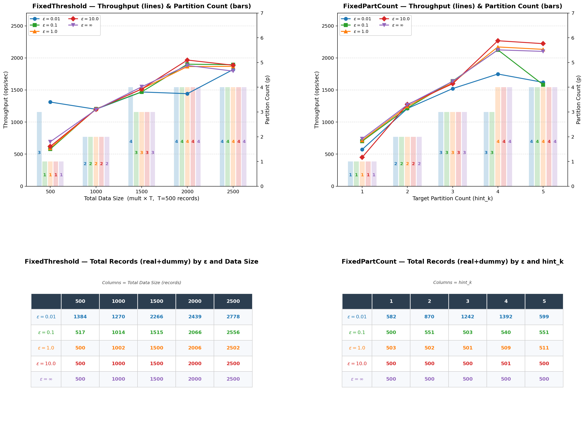
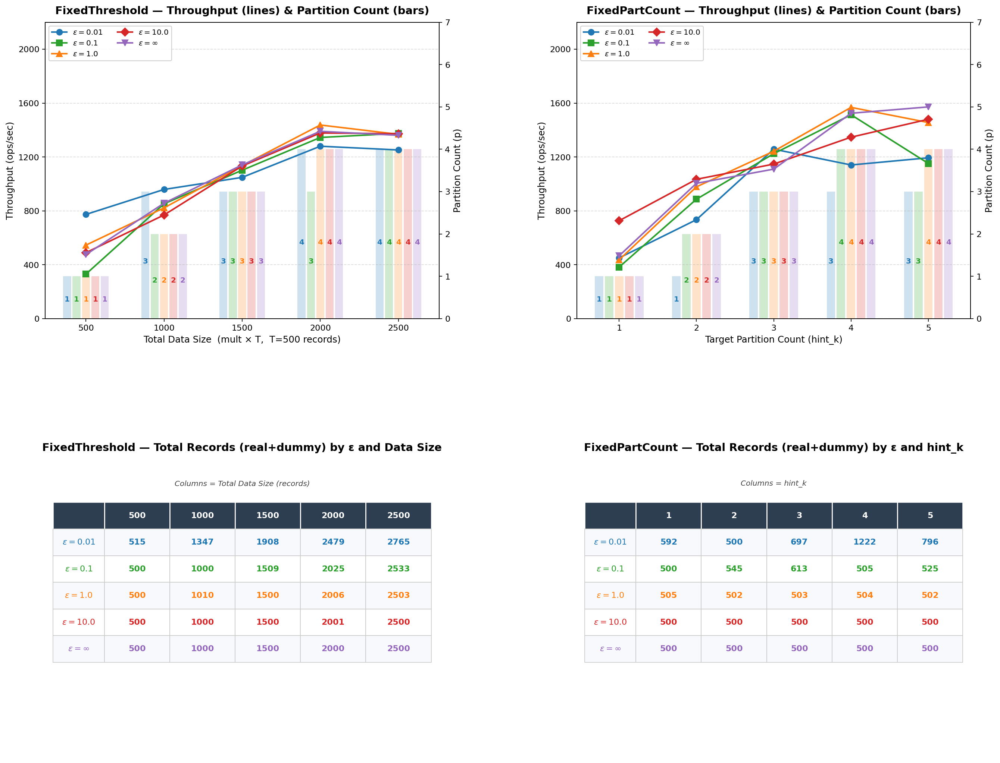
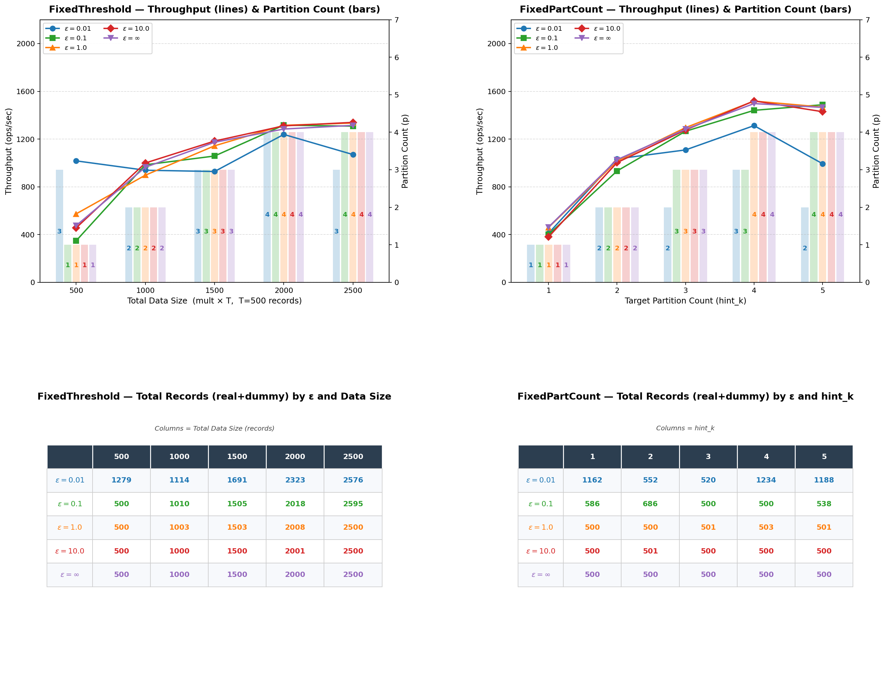
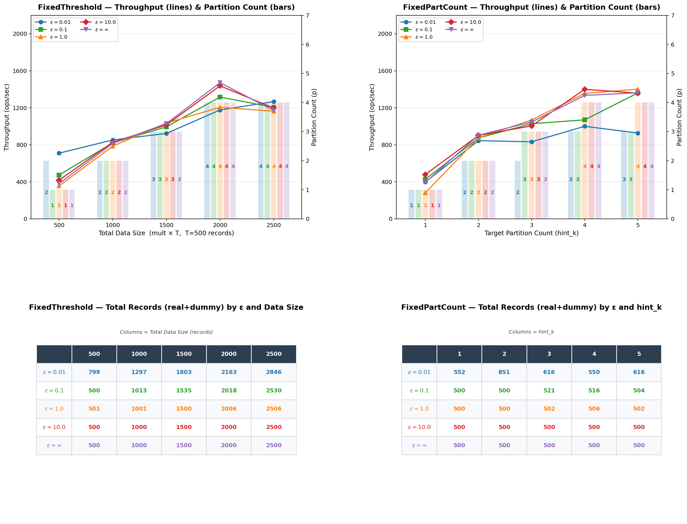

# DePart: Scaling ORAM-Backed Databases with Differentially Private Partitioning

This repository contains the research prototype for **DePart**, an ORAM-backed database system that scales transactional workloads using differentially private partitioning across multiple ORAM shards.

DePart combines:

1. DP-protected partitioning for constructing privacy-preserving ORAM shard layouts;
2. Multi-ORAM transaction execution with partition-aware routing, deduplication, and per-shard batch construction;
3. Insert-only ORAM support for growing databases through periodic DP-protected repartitioning.

This code accompanies the paper:

> **DePart: Scaling ORAM-Backed Databases with Differentially Private Partitioning**

## Artifact Status

This repository currently contains the source code for DePart and the scripts needed to build and run the prototype.

The full datasets used in the paper are **not included** in this repository. The experiments in the paper were run using TPC-C-style and synthetic workloads. To keep the repository lightweight and avoid distributing large generated data files, we provide instructions for running the system with synthetic inputs and for generating compatible workload files.

## Repository Layout
```text
.
├── src/
│   ├── RingORAM.cpp
│   ├── Repartition.cpp
│   ├── MultiRingORAM_Servers.cpp
│   ├── Queries_Receiving.cpp
│   └── ...
├── include/
│   ├── RingORAM.h
│   ├── Repartition.h
│   ├── MultiRingORAM_Servers.h
│   ├── Queries_Receiving.h
│   └── ...
├── Testing/
│   ├── Unit Tests/
│   ├── Experiment1/
│   ├── Experiment2/
│   ├── AWS Unit Tests/
│   └── ...
├── scripts/
│   └── ...
├── CMakeLists.txt
└── README.md
```

## Run Codes
### Compile
```text
mkdir build && cd build
cmake ..
make -j2
```
### TPC-C Generation
```text
./tpcc-generator 1 my_tpcc_input
```
### Other Experiments' Test
```text
Generate the uniform data distribution for Experiments $2-4$.
Generate the data distribution with $Zipf = 1$'s data for Experiment $5$.
./Servers_MultiRingORAM 8881
./ORAM_Performance_100R
```


## Experiments Results 
On a TPC-C benchmark workload with 4 shards and $\epsilon = 0.1$, \sys achieves $\sim 3 \times$ improvement in transaction throughput over the existing state of the art.




